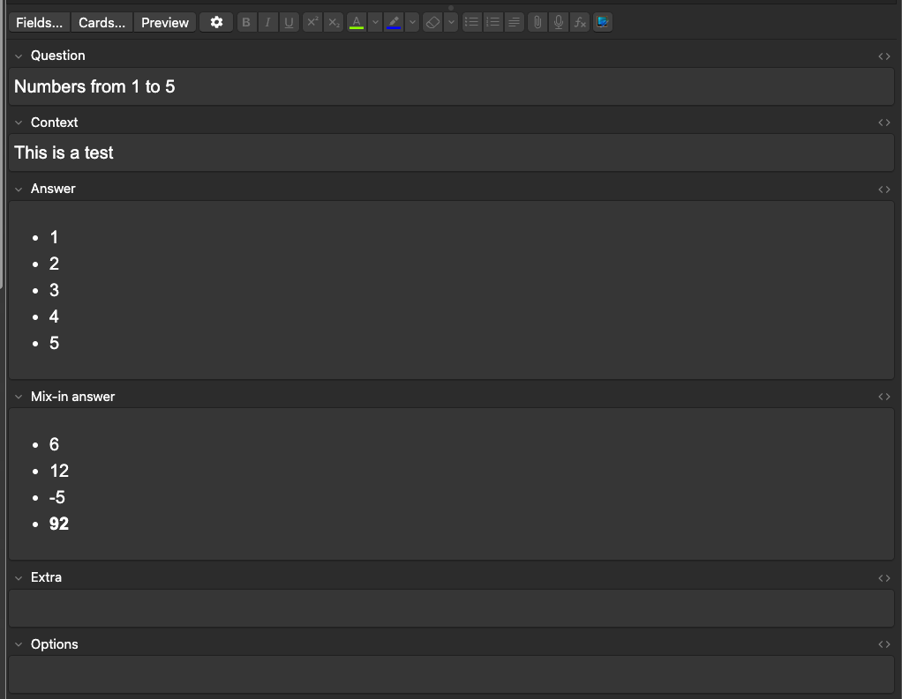
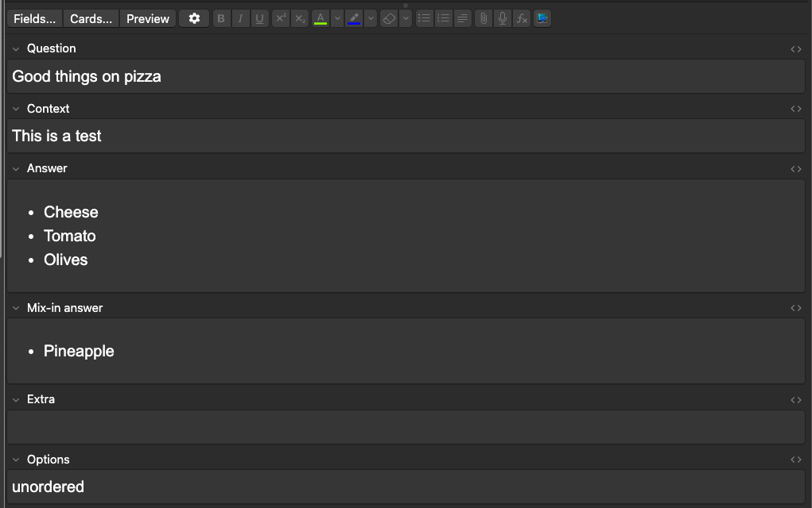
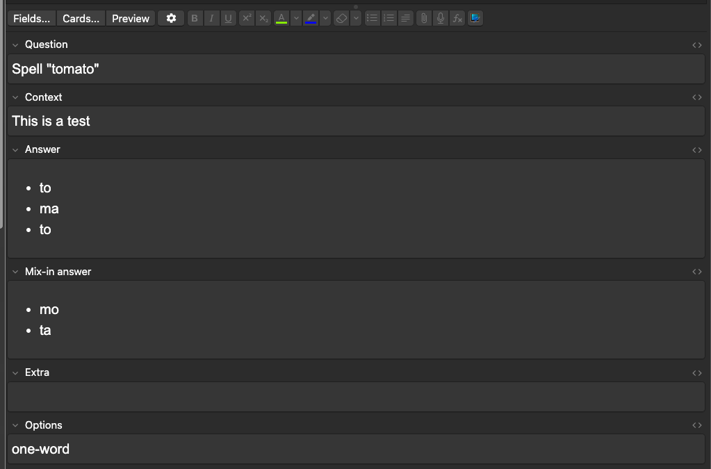
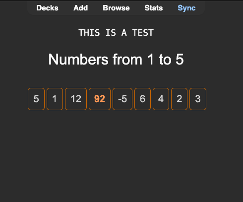
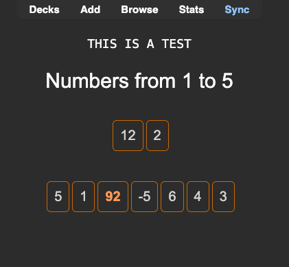
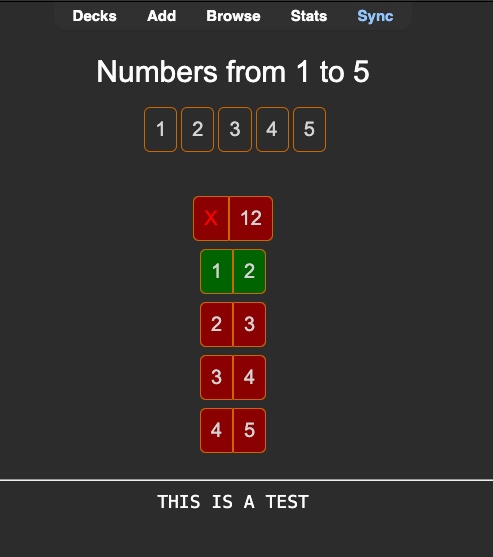
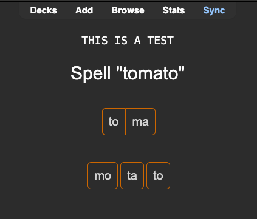
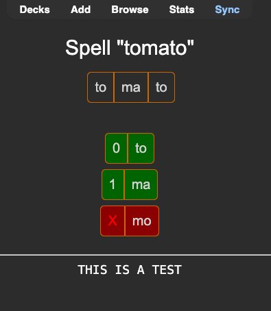

# Anki (ordered) multi-choice card template

<!-- vscode-markdown-toc -->
* 1. [Some screenshots](#Somescreenshots)
	* 1.1. [Editing cards](#Editingcards)
	* 1.2. [Answering](#Answering)
* 2. [Usage and field descriptions](#Usageandfielddescriptions)
	* 2.1. [Question](#Question)
	* 2.2. [Context](#Context)
	* 2.3. [Answer](#Answer)
	* 2.4. [Mix-in answer](#Mix-inanswer)
	* 2.5. [Extra](#Extra)
	* 2.6. [Options](#Options)

<!-- vscode-markdown-toc-config
	numbering=true
	autoSave=true
	/vscode-markdown-toc-config -->
<!-- /vscode-markdown-toc -->

This is an Anki template for multiple-choice question/answer, inspired by a Reddit post ([here](https://www.reddit.com/r/Anki/comments/1byctiz/note_type_puzzle_sentences/)). I created my own because I wanted a different set of features and to get it working on mobile. For mobile, I rely on Simon Lammer's [Anki Persistence script](https://github.com/SimonLammer/anki-persistence), which I inline in the template.

I have only tested this on Mac and iOS devices. It only relies on the persistence plugin (which should work everywhere) and the fact that links are clickable on mobile Anki without triggering `show answer` on tap.

##  1. Some screenshots and a screen recording

Below in *Usage* you can find what each field is used for.

Here is a video on mobile (iPhone) of the `one-word` mode:

https://github.com/rberenguel/anki--ordered--multi-choice/assets/2410938/0ee6ad86-51bc-4f84-8aee-8387e58f124a

###  1.1. Editing cards

###  1.2. Answering

I only show two types (`ordered` and `one-word`)

##  2. Usage and field descriptions

Start by either import the deck from the `sample-deck` folder (it has sample questions and the template itself) or just hack away with the template and fields in the template folder (this would be the advanced mode).

Then just create cards. The fields' description is the following (copied from `template/fields.md`)

Field description for this template

###  2.1. Question

The question you want to answer.

Examples:

1. Numbers from 1 to 3
2. Good toppings on pizza
3. Spelling of "tomato"
4. The poem Ode on a Grecian Urn by John Keats.

###  2.2. Context

This is a (non-required) field, I use it to have a general theme for questions that is more focused than tags. You can drop it if you want

###  2.3. Answer

The answer to the question. The format needs to be as an HTML list, like:

- 1
- 2
- 3

or

- to
- ma
- to

###  2.4. Mix-in answer

This is a field with "wrong options to pick up" like

- 42

or

- mo
- toe

It is not required, it is just useful for some kinds of questions and their answers.

###  2.5. Extra

This (like context) is a non-required field I usually add to all my cards. Sometimes I want to add additional information, it goes here.

###  2.6. Options

You can read more about options in the front and back templates. For now, options can be any of the following words:

- unordered
- one-word
- multiline

Each makes the formatting and answering to behave differently. If you check the examples for questions above, we would have one of each case:

1. _Numbers 1-3_ is an example of the default (no option set) mode: ordered, multiple words. One use case is foreign language phrases.
2. _Good toppings on pizza_ is an example of `unordered`. Arguably tomato should be below cheese, but the answer is good in any order. The use case here is lists of things you want to get right, like grammatical rules.
3. _Spelling of tomato_ is an example of `one-word`. The output is formatted nicely to form the word as if spelling it. Useful for spelling foreign words, particularly when adding as answer mix-ins what makes _you_ fail that spelling.
4. _Poem_ is an example of `multiline`. This is just formatted nicely when presenting the answer.
